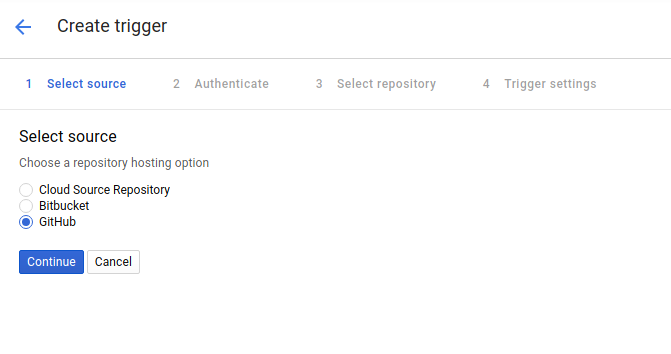
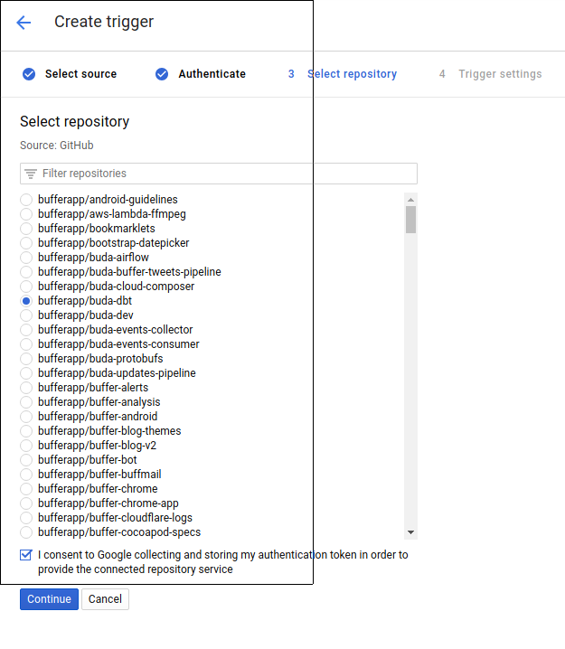
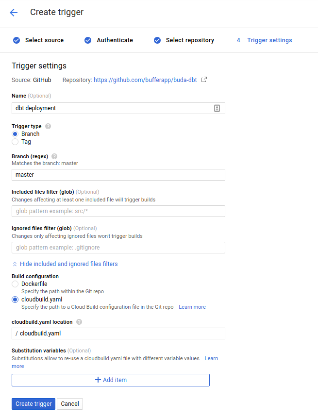

# Deploying with Cloud Build

We've experimented with using many different approaches to deploying code to production on the data team, but at present we're moving to using [Cloud Build](https://cloud.google.com/cloud-build/) as our standard way of deployment.

We aim to keep the process of deploying changes as simple as possible, in general the rule would be that pushing to the master branch will trigger a deployment.

Here is a quick rundown of the steps to deploy a service or cronjob that runs on [Apollo](https://github.com/bufferapp/README/blob/master/teams/data/docs/runbooks/kubernetes-apollo.md).


## Conventions

- All of your projects' Kubernetes resource definitions should live in a `kubernetes` directory.
- Your project should have a `Makefile`

1. Create a `cloudbuild.yaml` file.

For a Kubernetes project, you can use this template:

```yaml
steps:
- name: 'gcr.io/cloud-builders/docker'
  args: ['build', '-t', 'gcr.io/$PROJECT_ID/{{your-app-name}}:{{version}}', '.' ]
- name: 'gcr.io/cloud-builders/docker'
  args: ['push', 'gcr.io/$PROJECT_ID/{{your-app-name}}:{{version}}']
- name: 'gcr.io/cloud-builders/kubectl'
  args: ['apply', '-f', 'kubernetes/']
  env:
  - 'CLOUDSDK_COMPUTE_ZONE=us-central1-a'
  - 'CLOUDSDK_CONTAINER_CLUSTER=apollo'
```
Replace `{{your-app-name}}` and `{{version}}` with your values.

2. Make sure your deployment or cronjob is using the image you've specified in your `cloudbuild.yaml` file:


```yaml
apiVersion: extensions/v1beta1
kind: Deployment
...
spec:
  template:
    spec:
      containers:
      - image: gcr.io/buffer-data/{{your-app-name}}:{{version}}
```

3. Create a `make deploy` command in the `Makefile`. This is to test the deploy locally.

```Makefile
deploy:
	gcloud builds submit --config cloudbuild.yaml .
```

4. Create a Github build trigger from the [Cloud Build Console](https://console.cloud.google.com/cloud-build/triggers?project=buffer-data&authuser=0) for the buffer-data project. Make sure to only match on the `master` branch and specify to use a `cloudbuild.yaml` file.







5. That's it! Pushing to master should now build a Docker image of your app, push it to Google's container registry and deploy a new version of the app to Apollo. To view the result of all our builds, head to the [build history page](https://console.cloud.google.com/cloud-build/builds?authuser=0&project=buffer-data).
